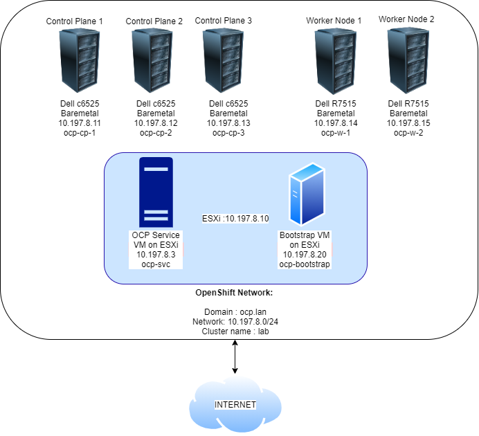

# Openshift-Install-Baremetal
Guide to setup openshift cluster on baremetal node with services such as DNS, HAProxy(LB) and DHCP. This also includes Calico setup as optional(not supported official in RHOCP 4)

# OpenShift 4 Bare Metal Install - User Provisioned Infrastructure (UPI)

- [OpenShift 4 Bare Metal Install - User Provisioned Infrastructure (UPI)](#openshift-4-bare-metal-install---user-provisioned-infrastructure-upi)
  - [Architecture Diagram](#architecture-diagram)
  - [Download Software](#download-software)
  - [Prepare the 'Bare Metal' environment](#prepare-the-bare-metal-environment)
  - [Configure Environmental Services](#configure-environmental-services)
  - [Generate and host install files](#generate-and-host-install-files)
  - [Deploy OpenShift](#deploy-openshift)
  - [Monitor the Bootstrap Process](#monitor-the-bootstrap-process)
  - [Remove the Bootstrap Node](#remove-the-bootstrap-node)
  - [Wait for installation to complete](#wait-for-installation-to-complete)
  - [Join Worker Nodes](#join-worker-nodes)
  - [Configure storage for the Image Registry](#configure-storage-for-the-image-registry)
  - [Setup OpenShift-CNV](#Setup-openshiftCNV)

## Architecture Diagram



## Download Software

1. Download [CentOS 8 x86_64 image](https://www.centos.org/centos-linux/)
1. Login to [RedHat OpenShift Cluster Manager](https://cloud.redhat.com/openshift)
1. Select 'Create Cluster' from the 'Clusters' navigation menu
1. Select 'RedHat OpenShift Container Platform'
1. Select 'Run on Bare Metal'
1. Download the following files:

   - Openshift Installer for Linux
   - Pull secret
   - Command Line Interface for Linux and your workstations OS
   - Red Hat Enterprise Linux CoreOS (RHCOS)
     - rhcos-4.4.3-x86_64-metal.x86_64.raw.gz
     - rhcos-4.4.3-x86_64-installer.x86_64.iso

## Prepare the 'Bare Metal' environment

> VMware ESXi used in this guide

1. Copy the CentOS 8 iso to an ESXi datastore
1. We are using flat networking hence use the same network on which the baremetal servers are connected to.
1. Create a Bootstrap virtual machine (this vm will be deleted once installation completes) with minimum settings:
   - Name: ocp-boostrap
   - 4vcpu
   - 16GB RAM
   - 160GB HDD
   - Load the rhcos-4.4.3-x86_64-installer.x86_64.iso image into the CD/DVD drive
1. Create a Services virtual machine with minimum settings:
   - Name: ocp-svc
   - 4vcpu
   - 8GB RAM
   - 150GB HDD
   - NIC1 connected to the VM Network (LAN)
   - Load the CentOS_8.iso image into the CD/DVD drive
1. Load all the other Baremetal servers with rhcos-4.4.3-x86_64-installer.x86_64.iso as a virtual media
   - Use the virutal media to mount the iso files.
   - I have used c6525 as control plane nodes and r7515 as worker nodes.
1. Boot both the virtual machines so they each are assigned a MAC address
1. Shut down bootstrap virtual machine.
1. Use the VMware ESXi dashboard to record the MAC address of bootstrap, these will be used later to set static IPs
   - Note down the NIC MAC address from the iDRAC console for all the bare metal machines.

## Configure Environmental Services

1. Install CentOS8 on the ocp-svc host

   - Remove the home dir partition and assign all free storage to '/'
   - Optionally you can install the 'Guest Tools' package to have monitoring and reporting in the VMware ESXi dashboard
   - Add ocp-svc as domain name 

1. Boot the ocp-svc VM

1. Download the files from the RedHat Cluster Manager site to the ocp-svc node

   ```bash
   wget "URL(openshift-install-linux.tar.gz)" 
   wget "URL(openshift-client-linux.tar.gz) 
   wget "URL(rhcos-x.x.x-x86_64-installer.x86_64.iso) 
   ```

1. Set IP and SSH to the ocp-svc vm

   
   1. Set a Static IP for the network interface `nmtui-edit ens192` or edit `/etc/sysconfig/network-scripts/ifcfg-ens192`

   - **Address**: 10.197.8.3
   - **DNS Server**: 127.0.0.1
   - **Search domain**: ocp.lan
   - Automatically connect
   
   ```bash
   ssh root@{ocp-svc_IP_address}
   ```

1. Extract Client tools and copy them to `/usr/local/bin`

   ```bash
   tar xvf openshift-client-linux.tar.gz
   mv oc kubectl /usr/local/bin
   ```

1. Confirm Client Tools are working

   ```bash
   kubectl version
   oc version
   ```

1. Extract the OpenShift Installer

   ```bash
   tar xvf openshift-install-linux.tar.gz
   ```

1. Update CentOS so we get the latest packages for each of the services we are about to install

   ```bash
   dnf update
   ```

1. Install Git

   ```bash
   dnf install git -y
   ```

1. Download [config files](https://github.com/AvRajath/openshift-install-baremetal) for each of the services

   ```bash
   git clone https://github.com/AvRajath/openshift-install-baremetal
   ```

1. Setup firewalld

  (Not required as we are using single interface. But added it if we are using 2 interfaces)
     ```bash
   firewall-cmd  --add-masquerade --permanent
   ```

   Reload firewall config

   ```bash
   firewall-cmd --reload
   ```

   Check the current settings of each zone

   ```bash
   firewall-cmd --list-all 
   ```

   When masquerading is enabled so is ip forwarding which basically makes this host a router. Check:

   ```bash
   cat /proc/sys/net/ipv4/ip_forward
   ```

1. Install and configure BIND DNS

   Install

   ```bash
   dnf install bind bind-utils -y
   ```

   Apply configuration

   ```bash
   \cp ~/openshift-install-baremetal/dns/named.conf /etc/named.conf
   cp -R ~/openshift-install-baremetal/dns/zones /etc/named/
   ```

   Configure the firewall for DNS

   ```bash
   firewall-cmd --add-port=53/udp --permanent
   firewall-cmd --reload
   ```

   Enable and start the service

   ```bash
   systemctl enable named
   systemctl start named
   systemctl status named
   ```

   > At the moment DNS will still be pointing to the LAN DNS server. You can see this by testing with `dig ocp.lan`.

   Change the LAN nic (ens192) to use 127.0.0.1 for DNS AND ensure `Ignore automatically Obtained DNS parameters` is ticked

   ```bash
   nmtui-edit ens192
   ```

   Restart Network Manager

   ```bash
   systemctl restart NetworkManager
   ```

   Confirm dig now sees the correct DNS results by using the DNS Server running locally

   ```bash
   dig ocp.lan
   # The following should return the answer ocp-bootstrap.lab.ocp.lan from the local server
   dig -x 10.197.8.20
   ```

1. Install & configure DHCP

   Install the DHCP Server

   ```bash
   dnf install dhcp-server -y
   ```

   Edit dhcpd.conf from the cloned git repo to have the correct mac address for each host and copy the conf file to the correct location for the DHCP service to use

   ```bash
   \cp ~/openshift-install-baremetal/dhcpd.conf /etc/dhcp/dhcpd.conf
   ```

   Configure the Firewall

   ```bash
   firewall-cmd --add-service=dhcp --permanent
   firewall-cmd --reload
   ```

   Enable and start the service

   ```bash
   systemctl enable dhcpd
   systemctl start dhcpd
   systemctl status dhcpd
   ```

1. Install & configure Apache Web Server

   Install Apache

   ```bash
   dnf install httpd -y
   ```

   Change default listen port to 8080 in httpd.conf

   ```bash
   sed -i 's/Listen 80/Listen 0.0.0.0:8080/' /etc/httpd/conf/httpd.conf
   ```

   Configure the firewall for Web Server traffic

   ```bash
   firewall-cmd --add-port=8080/tcp --permanent
   firewall-cmd --reload
   ```

   Enable and start the service

   ```bash
   systemctl enable httpd
   systemctl start httpd
   systemctl status httpd
   ```

   Making a GET request to localhost on port 8080 should now return the default Apache webpage

   ```bash
   curl localhost:8080
   ```

1. Install & configure HAProxy

   Install HAProxy

   ```bash
   dnf install haproxy -y
   ```

   Copy HAProxy config

   ```bash
   \cp ~/openshift-install-baremetal/haproxy.cfg /etc/haproxy/haproxy.cfg
   ```

   Configure the Firewall

   > Note: Opening port 9000 in the external zone allows access to HAProxy stats that are useful for monitoring and troubleshooting. The UI can be accessed at: `http://{ocp-svc_IP_address}:9000/stats`

   ```bash
   firewall-cmd --add-port=6443/tcp --permanent # kube-api-server on control plane nodes
   firewall-cmd --add-port=22623/tcp--permanent # machine-config server
   firewall-cmd --add-service=http --permanent # web services hosted on worker nodes
   firewall-cmd --add-service=https --permanent # web services hosted on worker nodes
   firewall-cmd --add-port=9000/tcp --permanent # HAProxy Stats
   firewall-cmd --reload
   ```

   Enable and start the service

   ```bash
   setsebool -P haproxy_connect_any 1 # SELinux name_bind access
   systemctl enable haproxy
   systemctl start haproxy
   systemctl status haproxy
   ```

1. Install and configure NFS for the OpenShift Registry. It is a requirement to provide storage for the Registry, emptyDir can be specified if necessary.

   Install NFS Server

   ```bash
   dnf install nfs-utils -y
   ```

   Create the Share

   Check available disk space and its location `df -h`

   ```bash
   mkdir -p /shares/registry
   chown -R nobody:nobody /shares/registry
   chmod -R 777 /shares/registry
   ```

   Export the Share

   ```bash
   echo "/shares/registry  10.197.8.0/24(rw,sync,root_squash,no_subtree_check,no_wdelay)" > /etc/exports
   exportfs -rv
   ```

   Set Firewall rules:

   ```bash
   firewall-cmd --add-service mountd --permanent
   firewall-cmd --add-service rpc-bind --permanent
   firewall-cmd --add-service nfs --permanent
   firewall-cmd --reload
   ```

   Enable and start the NFS related services

   ```bash
   systemctl enable nfs-server rpcbind
   systemctl start nfs-server rpcbind nfs-mountd
   ```

## Generate and host install files

1. Generate an SSH key pair keeping all default options

   ```bash
   ssh-keygen
   ```

1. Create an install directory

   ```bash
   mkdir ~/ocp-install
   ```

1. Copy the install-config.yaml included in the clones repository to the install directory

   ```bash
   cp ~/openshift-install-baremetal/install-config.yaml ~/ocp-install
   ```

1. Update the install-config.yaml with your own pull-secret and ssh key.

   - Line 23 should contain the contents of your pull-secret.txt
   - Line 24 should contain the contents of your '~/.ssh/id_rsa.pub'

   ```bash
   vim ~/ocp-install/install-config.yaml
   ```

1. Generate Kubernetes manifest files

   ```bash
   ~/openshift-install create manifests --dir ~/ocp-install
   ```

   > A warning is shown about making the control plane nodes schedulable. It is up to you if you want to run workloads on the Control Plane nodes. If you dont want to you can disable this with:
   > `sed -i 's/mastersSchedulable: true/mastersSchedulable: false/' ~/ocp-install/manifests/cluster-scheduler-02-config.yml`.
   > Make any other custom changes you like to the core Kubernetes manifest files.

   Generate the Ignition config and Kubernetes auth files

   ```bash
   ~/openshift-install create ignition-configs --dir ~/ocp-install/
   ```

1. Create a hosting directory to serve the configuration files for the OpenShift booting process

   ```bash
   mkdir /var/www/html/ocp4
   ```

1. Copy all generated install files to the new web server directory

   ```bash
   cp -R ~/ocp-install/* /var/www/html/ocp4
   ```

1. Move the Core OS image to the web server directory (later you need to type this path multiple times so it is a good idea to shorten the name)

   ```bash
   mv ~/rhcos-4.4.3-x86_64-metal.x86_64.raw.gz /var/www/html/ocp4/rhcos
   ```

1. Change ownership and permissions of the web server directory

   ```bash
   chcon -R -t httpd_sys_content_t /var/www/html/ocp4/
   chown -R apache: /var/www/html/ocp4/
   chmod 755 /var/www/html/ocp4/
   ```

1. Confirm you can see all files added to the `/var/www/html/ocp4/` dir through Apache

   ```bash
   curl localhost:8080/ocp4/
   ```

## Deploy OpenShift

1. Power on the ocp-bootstrap host and ocp-cp-\# hosts and select 'Tab' to enter boot configuration. Enter the following configuration:

   ```bash
   # Bootstrap Node - ocp-bootstrap
   coreos.inst.install_dev=sda coreos.inst.image_url=http://192.168.22.1:8080/ocp4/rhcos coreos.inst.ignition_url=http://192.168.22.1:8080/ocp4/bootstrap.ign
   ```

   - For control and worker nodes as they are running on the Dell servers the console input for then has to be entered in the first line just after coreos.inst=yes. Also give only 1 space between each command otherwise the whole install fails.
   
   ```bash
   # Each of the Control Plane Nodes - ocp-cp-\#
   coreos.inst.install_dev=sda coreos.inst.image_url=http://10.197.8.3:8080/ocp4/rhcos coreos.inst.ignition_url=http://10.197.8.3:8080/ocp4/master.ign
   ```

1. Power on the ocp-w-\# hosts and select 'Tab' to enter boot configuration. Enter the following configuration:

   ```bash
   # Each of the Worker Nodes - ocp-w-\#
   coreos.inst.install_dev=sda coreos.inst.image_url=http://10.197.8.3:8080/ocp4/rhcos coreos.inst.ignition_url=http://10.197.8.3:8080/ocp4/worker.ign
   ```

## Monitor the Bootstrap Process

1. You can monitor the bootstrap process from the ocp-svc host at different log levels (debug, error, info)

   ```bash
   ~/openshift-install --dir ~/ocp-install wait-for bootstrap-complete --log-level=debug
   ```

1. Once bootstrapping is complete the ocp-boostrap node [can be removed](#remove-the-bootstrap-node)

## Remove the Bootstrap Node

1. Remove all references to the `ocp-bootstrap` host from the `/etc/haproxy/haproxy.cfg` file

   ```bash
   # Two entries
   vim /etc/haproxy/haproxy.cfg
   # Restart HAProxy - If you are still watching HAProxy stats console you will see that the ocp-boostrap host has been removed from the backends.
   systemctl reload haproxy
   ```

1. The ocp-bootstrap host can now be safely shutdown and deleted from the VMware ESXi Console, the host is no longer required

## Wait for installation to complete

> IMPORTANT: if you set mastersSchedulable to false the [worker nodes will need to be joined to the cluster](#join-worker-nodes) to complete the installation. This is because the OpenShift Router will need to be scheduled on the worker nodes and it is a dependency for cluster operators such as ingress, console and authentication.

1. Collect the OpenShift Console address and kubeadmin credentials from the output of the install-complete event

   ```bash
   ~/openshift-install --dir ~/ocp-install wait-for install-complete
   ```

1. Continue to join the worker nodes to the cluster in a new tab whilst waiting for the above command to complete

## Join Worker Nodes

1. Setup 'oc' and 'kubectl' clients on the ocp-svc machine

   ```bash
   export KUBECONFIG=~/ocp-install/auth/kubeconfig
   # Test auth by viewing cluster nodes
   oc get nodes
   ```

1. View and approve pending CSRs

   > Note: Once you approve the first set of CSRs additional 'kubelet-serving' CSRs will be created. These must be approved too.
   > If you do not see pending requests wait until you do.

   ```bash
   # View CSRs
   oc get csr
   # Approve all pending CSRs
   oc get csr -o go-template='{{range .items}}{{if not .status}}{{.metadata.name}}{{"\n"}}{{end}}{{end}}' | xargs oc adm certificate approve
   # Wait for kubelet-serving CSRs and approve them too with the same command
   oc get csr -o go-template='{{range .items}}{{if not .status}}{{.metadata.name}}{{"\n"}}{{end}}{{end}}' | xargs oc adm certificate approve
   ```

1. Watch and wait for the Worker Nodes to join the cluster and enter a 'Ready' status

   > This can take 5-10 minutes

   ```bash
   watch -n5 oc get nodes
   ```

## Configure storage for the Image Registry

> A Bare Metal cluster does not by default provide storage so the Image Registry Operator bootstraps itself as 'Removed' so the installer can complete. As the installation has now completed storage can be added for the Registry and the operator updated to a 'Managed' state.

1. Create the 'image-registry-storage' PVC by updating the Image Registry operator config by updating the management state to 'Managed' and adding 'pvc' and 'claim' keys in the storage key:

   ```bash
   oc edit configs.imageregistry.operator.openshift.io
   ```

   ```yaml
   managementState: Managed
   ```

   ```yaml
   storage:
     pvc:
       claim: # leave the claim blank
   ```

1. Confirm the 'image-registry-storage' pvc has been created and is currently in a 'Pending' state

   ```bash
   oc get pvc -n openshift-image-registry
   ```

1. Create the persistent volume for the 'image-registry-storage' pvc to bind to

   ```bash
   oc create -f ~/ocp4-metal-install/manifest/registry-pv.yaml
   ```

1. After a short wait the 'image-registry-storage' pvc should now be bound

   ```bash
   oc get pvc -n openshift-image-registry
   ```

## Setup OpenShift-CNV
